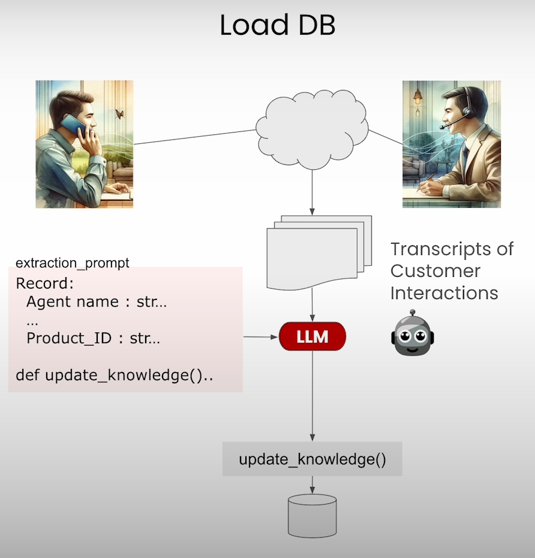

# NexusLLM for Text-to-SQL

  

# :memo: Description

Nowadays, the world revolves around data. We created elaborate infrastructures, namely databases, to interact with the data in efficient ways. Yet, this requires more sophisticates techniques like mastering SQL access the data, which locks away information for people that lack knowledge of SQL. Currently, Large Language Models (LLMs) are becomming more and more popluar for interaction with databases enabling everyone to gain insights using the databases content. This short project looks into LLMs how they can call function by providing precise arguments helping to to interact with databases. 
This project has two parts:
* First, I'll let a LLM interact with a dataset generating features like a sentiment of a dialogue and names of involved persons. It uses the LLM capabilty of function calling to built a dialgue processing system. 
* The second part explores the ability of an LLM to interact with databases by creating increasingly more complex question and analyzing typical hallucinations.

The html document generated from the Jupyter notebook can found on my [portfolio page](https://sebastianghafafian.github.io/Portfolio/NexusLLM.html).

# :open_file_folder: Data Set

The Customer Service dataset used in this project is freely available from [HuggingFace](https://huggingface.co/datasets/SantiagoPG/customer_service_chatbot). It contains 1000 records of interactions of customers and customer service containing data about the type of issue, product category and more. I will be focussing on the conversation dialogue that happened between both parties. This allows for interesting applications of LLMs to extract features from text.

The other database I used in the project is the Chinook database. It contains several tables which allows to build more ellaborate SQL queries including joins.

# Requirements

The requirements.txt shows the python environment used for the project.

